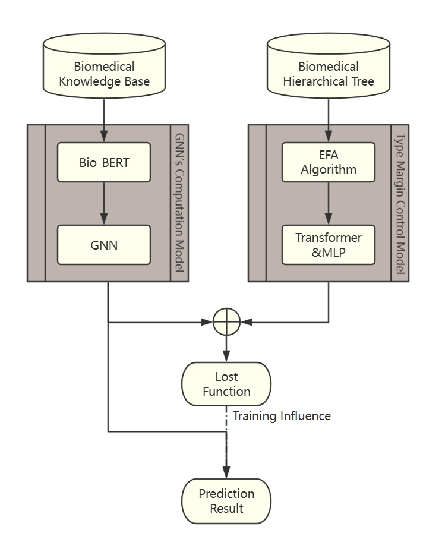

# HAG_BioKMS
# HAG — Hierarchy-guided Attention Graph for Fine-grained Biomedical Link Prediction

A lightweight model for fine-grained hypothesis generation and link prediction in **biomedical** and **space life sciences**.  
HAG integrates **BioBERT embeddings**, **GraphSAGE propagation**, and a novel **Type Margin Control Module** that leverages the **UMLS semantic hierarchy** to dynamically adjust margins between confusing entities.  

---

## 🚀 Key Features
- **Hybrid architecture**: BioBERT + GraphSAGE + MLP.  
- **Type Margin Control Module**: minibatch-EAF + Transformer → dynamic margins.  
- **Lightweight**: fewer parameters compared to heavy Transformer-based baselines.  
- **Fine-grained capability**: better handling of semantically similar but distinct biomedical entities.  
- **Designed for space biosciences**: applied to corpora including NASA textual experiment records.  

---

## 📊 Architecture Overview
Text corpus (SemRep extraction) → Entities & Edges
↓
BioBERT → Initial node embeddings
↓
GraphSAGE (with 2-norm preservation)
↓
Type Margin Control Module
(UMLS hierarchy + minibatch-EAF + Transformer → margins)
↓
Link Prediction (MLP)
↓
Output: Predicted link score


<p align="center">
  
</p>

---

## ⚙️ Installation

Clone the repo and install requirements:

```bash
git clone https://github.com/<your-org>/HAG-BioKMS.git
cd HAG-BioKMS

python -m venv venv
source venv/bin/activate
pip install -r requirements.txt
